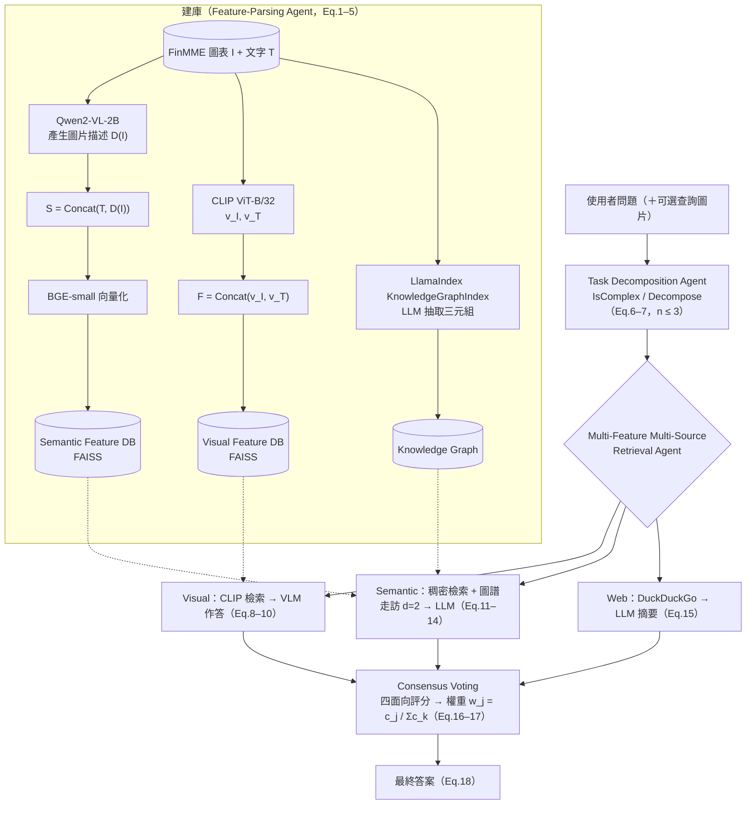

# MMM-RAG: Multi-Agent Multimodal RAG for Financial Charts

> 碩士實驗室論文重現｜國立中山大學電機工程學系 數據科學實驗室｜Python、PyTorch、Transformers、FAISS、LlamaIndex

[中文](#中文) | [English](#english)

---

## 中文

本專案以消費級顯卡（**RTX 5060 8GB**）重新實作 ICPADS 2025 論文 **MMM-RAG** 的完整架構，並把知識庫換成財經圖表資料集 **FinMME**。所有模組（資料下載、雙特徵資料庫建置、知識圖譜、三個 Agent、共識投票）皆由我獨立實作。

> T. Chang, Y. Fang, and Y. Zhang, "MMM-RAG: A multi-agent multi-feature method for multimodal retrieval-augmented generation," in *Proc. 2025 IEEE 31st Int. Conf. Parallel and Distributed Systems (ICPADS)*, Hefei, China, Dec. 2025, pp. 1–8.

> ⚠️ 這是架構重現／教學專案，**不構成任何投資建議**；目標是忠實重現論文的系統設計，而不是追求答案正確率。

### 系統架構



### 論文元件與實作對照

| 論文元件 | 公式 | 檔案 | 本地模型（論文原設定） |
|---|---|---|---|
| Feature-Parsing Agent | Eq.1–5 | `scripts/03_build_knowledge_base.py` | Qwen2-VL-2B + CLIP ViT-B/32 + BGE-small（Qwen2.5-VL-7B、BLIP-2） |
| Semantic / Visual Feature DB | Eq.2, 5 | `mmm_rag/vector_store.py` | FAISS `IndexFlatIP`（cosine） |
| 知識圖譜 | Eq.13 | `mmm_rag/graph_store.py`、`scripts/04_build_graph_index.py` | LlamaIndex `KnowledgeGraphIndex` |
| Task Decomposition Agent | Eq.6–7 | `mmm_rag/decomposition_agent.py` | Qwen2.5-3B-Instruct（Qwen3-14B） |
| Retrieval Agent（visual / semantic / web） | Eq.8–15 | `mmm_rag/retrieval_agent.py` | CLIP、BGE、ddgs |
| Consensus Voting & Answer Generation | Eq.16–18 | `mmm_rag/decision_agent.py` | Qwen2.5-3B-Instruct |
| 模型載入與 VRAM 管理 | — | `mmm_rag/model_manager.py` | 4-bit NF4 量化（bitsandbytes） |

### 資料集

- **FinMME**（[`luojunyu/FinMME`](https://huggingface.co/datasets/luojunyu/FinMME)）：11,000+ 筆財經研究報告圖表與問答。
- 預設取前 **300 筆**建庫（`config.DATASET_SUBSET_SIZE`），圖片描述來自 `verified_caption` + `related_sentences`。
- 資料集、模型權重與建好的資料庫都不上傳，可用 `scripts/` 重新產生。

### 主要參數（`config.py`）

| 參數 | 值 | 說明 |
|---|---|---|
| `TOP_K` | 3 | 檢索深度 |
| `GRAPH_TRAVERSAL_DEPTH` | 2 | 圖譜走訪深度 d（Eq.13） |
| `MAX_SUBTASKS` | 3 | 子任務上限 n（Eq.7） |
| `USE_4BIT` / `LOW_VRAM_MODE` | True / False | 4-bit 量化；顯存不足時改 True 讓模型輪流載入 |

### 安裝與執行

```bash
# 1. 先依顯卡安裝 PyTorch（RTX 50 系列需 cu128，詳見 docs/setup-guide-zh.md）
pip install torch==2.8.0 torchvision==0.23.0 --index-url https://download.pytorch.org/whl/cu128
pip install -r requirements.txt
cp .env.example .env               # 選填：設定 HF_HOME / HF_TOKEN

# 2. 環境檢查 → 下載資料 → 建雙特徵資料庫 → 建知識圖譜
python scripts/01_setup_check.py
python scripts/02_download_dataset.py
python scripts/03_build_knowledge_base.py
python scripts/04_build_graph_index.py

# 3. 查詢（可附上自己的圖表）
python main.py --sample
python main.py --question "分析師解讀股價走勢圖時會關注哪些訊號？" --image my_chart.png
```

每次查詢的完整中間過程（子任務、三個候選答案、分數與權重）會存到 `logs/run_<timestamp>.json`。

不需要 GPU 的邏輯測試：`python tests/smoke_test.py`

詳細的逐步安裝說明與 VRAM 調校 FAQ 請見 [`docs/setup-guide-zh.md`](docs/setup-guide-zh.md)。

### 結果

- 系統設計為可在單張 RTX 5060 8GB 上執行（300 筆建庫預估約 10–25 分鐘）。
- 論文的量化結果是在 ScienceQA 與 CrisisMMD 上以 Accuracy 評估；本專案改用 FinMME 且換成小模型，**尚未做與論文可直接比較的量化評估**，這是下一步的工作。

### 專案結構

```
config.py                 # 所有可調參數
main.py                   # 端到端查詢入口
mmm_rag/                  # 三個 Agent、向量庫、知識圖譜、模型管理
scripts/01–04_*.py        # 環境檢查、下載資料、建庫、建圖譜
tests/smoke_test.py       # 不需 GPU 的邏輯測試
docs/setup-guide-zh.md    # 詳細安裝與 FAQ
```

### 學到的東西

- 把論文公式逐一對應到程式模組，並在硬體限制下選擇等價的替代模型
- 多模態檢索：雙塔 CLIP 特徵串接、稠密檢索與知識圖譜檢索融合
- 多 Agent 協作與以 LLM 評分的加權共識投票
- 8GB VRAM 下的 4-bit 量化與模型輪替載入

---

## English

A from-scratch re-implementation of the ICPADS 2025 paper **MMM-RAG** that fits on a single consumer GPU (**RTX 5060, 8 GB**), using the financial-chart dataset **FinMME** as its knowledge base. I implemented every module: data loading, the two feature databases, the knowledge graph, the three agents and the consensus voting.

> T. Chang, Y. Fang, and Y. Zhang, "MMM-RAG: A multi-agent multi-feature method for multimodal retrieval-augmented generation," in *Proc. 2025 IEEE 31st Int. Conf. Parallel and Distributed Systems (ICPADS)*, Hefei, China, Dec. 2025, pp. 1–8.

> ⚠️ This is an architecture reproduction for learning purposes and **not investment advice**.

### Architecture

See the Mermaid diagram above. In short:

1. **Feature-Parsing Agent (Eq. 1–5)** builds a *semantic* database (Qwen2-VL caption + source text → BGE embeddings) and a *visual* database (CLIP image ⊕ text vectors), both in FAISS, plus a LlamaIndex knowledge graph whose triplets are extracted by the LLM.
2. **Task Decomposition Agent (Eq. 6–7)** decides whether a query is complex and splits it into at most 3 sub-questions.
3. **Retrieval Agent (Eq. 8–15)** answers each sub-question from three sources: visual (CLIP search → VLM), semantic (dense search + graph traversal, depth 2 → LLM) and web (DuckDuckGo → LLM).
4. **Consensus Voting (Eq. 16–18)** has the LLM rate each candidate on consistency, coherence, relevance and credibility, normalises the scores into weights `w_j = c_j / Σc_k`, and fuses the final answer.

| Component | Local model (paper) |
|---|---|
| Text LLM | Qwen2.5-3B-Instruct, 4-bit (Qwen3-14B) |
| VLM | Qwen2-VL-2B-Instruct, 4-bit (Qwen2.5-VL-7B) |
| Visual dual encoder | CLIP ViT-B/32 (BLIP-2) |
| Text embedding | BAAI/bge-small-en-v1.5 |

### Dataset

**FinMME** (`luojunyu/FinMME`, 11k+ financial report charts with QA). The first 300 samples are indexed by default. Data, model weights and built indexes are not committed; the `scripts/` rebuild them.

### Run

```bash
pip install torch==2.8.0 torchvision==0.23.0 --index-url https://download.pytorch.org/whl/cu128
pip install -r requirements.txt
python scripts/01_setup_check.py && python scripts/02_download_dataset.py
python scripts/03_build_knowledge_base.py && python scripts/04_build_graph_index.py
python main.py --sample            # or --question "..." [--image chart.png]
python tests/smoke_test.py         # logic test, no GPU needed
```

### Results

The system is designed to run on a single RTX 5060 8 GB (indexing 300 samples is estimated at 10–25 minutes). The paper reports accuracy on ScienceQA and CrisisMMD; this project uses FinMME and smaller models, so **no directly comparable quantitative evaluation has been done yet**.

### What I learned

- Mapping a paper's equations onto code modules and choosing equivalent smaller models under hardware limits
- Multimodal retrieval with dual-encoder features, dense search and knowledge-graph traversal
- Multi-agent orchestration and LLM-scored weighted consensus voting
- 4-bit quantisation and model swapping to fit in 8 GB of VRAM
